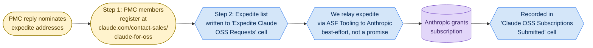
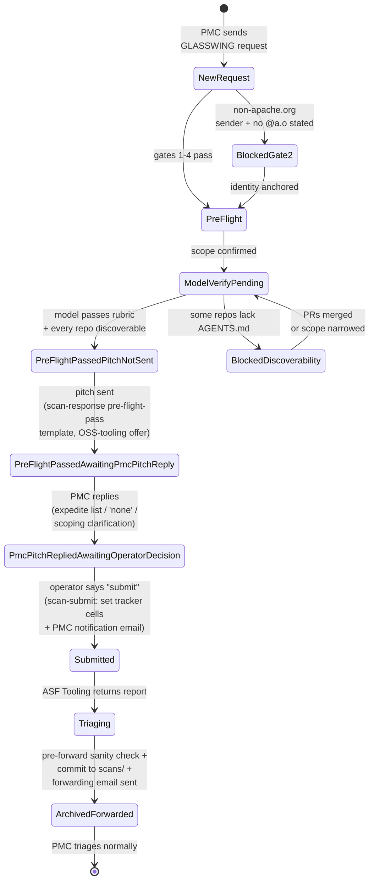
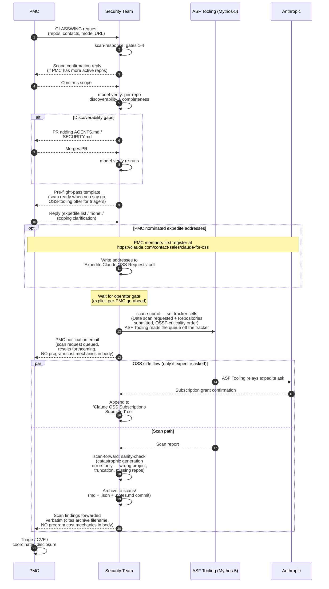
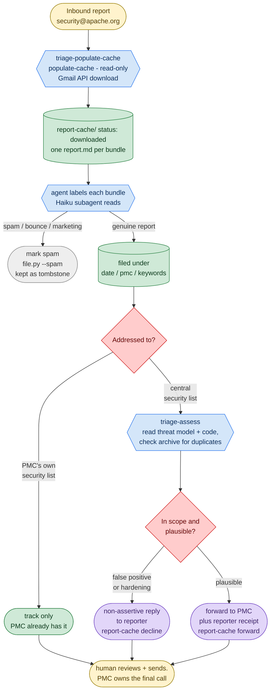

<!-- SPDX-License-Identifier: Apache-2.0
     https://www.apache.org/licenses/LICENSE-2.0 -->

# apache/security

Operational home for the ASF Security team. Holds the reusable
**agent skills** (a.k.a. SKILLs) the team uses to run the
Mythos / Glasswing scan program end-to-end, plus the upstream
[`threat-model-producer`](.github/skills/threat-model-producer/SKILL.md)
recipe used to bootstrap project threat models when a PMC
doesn't have one yet.

If you landed here looking for **how to report a security
vulnerability in an Apache project**, see
<https://www.apache.org/security/> — this repo is the Security
team's tooling, not the public reporting entry point.

## What's in this repository

```
.github/skills/                     — canonical home of all SKILLs
├── README.md                       — per-SKILL index + contribution notes
│   # Glasswing scan-outreach program
├── frontier-model-preparation-run/             — periodic-sweep umbrella
├── frontier-model-preparation-response/        — handles inbound [GLASSWING] requests
├── frontier-model-preparation-model-verify/         — pre-flight model assessment
├── frontier-model-preparation-update/          — all writes to the Mythos tracker
│                                      (writes go through tools/sheets_writer/)
├── frontier-model-preparation-status/          — status / rollup view
├── frontier-model-preparation-submit/          — operator-gated spreadsheet-then-email enrollment
│                                      (set tracker cells, then PMC email)
├── frontier-model-preparation-forward/         — sanity-check + forward results to PMC verbatim
├── frontier-model-preparation-dashboard/            — refresh tracker tabs + a private gist dashboard
│   # Inbound security-report triage (foundation-wide security@apache.org)
├── triage-populate-cache/          — pull new reports into the local report-cache/
├── triage-assess/                  — assess cached reports + draft PMC/reporter replies
│   # Shared
└── threat-model-producer/          — model-authoring rubric, used by both
                                      areas (imported from Scovetta's gist)

tools/                              — small Python projects with pyproject.toml,
                                      tests, and CI; invoked from SKILLs
├── jira_writer/                    — Apache JIRA write helper (PAT-authed);
│                                      see tools/jira_writer/README.md
├── form_submitter/                 — retired legacy form filler (external-relay
│                                      era); see tools/form_submitter/README.md
├── sheets_writer/                  — Google Sheets writer for the tracker;
│                                      see tools/sheets_writer/README.md
├── model_pr/                       — opens AGENTS.md→SECURITY.md→model
│                                      discoverability PRs on PMC repos;
│                                      see tools/model_pr/README.md
├── forward_draft/                  — OAuth Gmail draft with attachments
│                                      (scan .zip + assessment .md) for the
│                                      scan-forward step; no HTML/tracking;
│                                      see tools/forward_draft/README.md
└── whimsy_lookup/                  — Deterministic Whimsy/LDAP lookups for
                                      Gate 2 + Gate 3 identity checks;
                                      see tools/whimsy_lookup/README.md

.claude/skills/                     — symlinks so Claude Code finds the SKILLs
```

The SKILLs cover two programs: the **Glasswing scan-outreach** pipeline
(PMC opt-in → pre-flight → enroll in tracker → ASF Tooling scan → forward)
and **inbound security-report triage** (pulling `security@apache.org`
reports into a local cache and drafting responses). `threat-model-producer`
is shared.

Adding a new agent-runtime convention later means adding another
symlink under that runtime's expected location — never duplicating
content.

### Two helper tiers — inline scripts vs. `tools/` projects

The repo distinguishes between two scales of Python helper:

- **Inline scripts inside a SKILL directory** — single files using
  PEP 723 inline metadata via `uv run`. No `pyproject.toml`, no test
  suite, no CI. Right for narrow helpers a single SKILL owns
  end-to-end. The repo currently has none of these — every Python
  helper has been promoted to `tools/`.
- **Standalone projects under `tools/`** (`tools/jira_writer/`,
  `tools/whimsy_lookup/`, `tools/form_submitter/`,
  `tools/sheets_writer/`, `tools/model_pr/`,
  `tools/forward_draft/`) — proper Python projects with `pyproject.toml`,
  unit tests, CI. Right for helpers that **multiple** SKILLs need (or
  expect to soon), have non-trivial logic worth test-covering, or
  interact with a system where regressions are expensive (e.g. JIRA
  writes to apache.org, Whimsy/LDAP lookups that drive PMC-facing
  emails). A SKILL invokes them via
  `uv run --project tools/<name> <cli> ...`.

The promotion path is one-way: if an inline script grows two
callers + non-trivial logic + a "we regret a regression here would
be costly" flavour, it moves to `tools/`. See
[`tools/jira_writer/README.md`](tools/jira_writer/README.md) for the
first project of that tier — added 2026-05-27 after the inline
`jira_writer.py` reached operational use against the HBase PMC.

## The Mythos / Glasswing scan program

Mythos (internal name) / Glasswing (public name) lets Apache
PMCs opt in to **agentic security scans** of their repositories.
The compute cost is on the program; the PMC commits to (a)
triaging real findings and (b) maintaining a threat model the
scan can run against. Scans are now run **internally by the ASF**
— VP Tooling + Infra + Security jointly (**ASF Tooling**), on the
Mythos-5 model — with results landing in the
`apache/tooling-agents-private` archive (the earlier external
Alpha-Omega relay path is retired). The Security team coordinates
the operational side: inbound requests, pre-flight checks,
enrolling the scan in the Mythos tracker, pre-forward sanity
check of returned reports (catching catastrophic generation
errors only — wrong project, wrong/stale model, truncated output,
missing repos), and verbatim delivery of the scan's findings to
the PMC. Per-finding triage stays with the PMC against the
project's own threat model — the Security team does not curate,
classify, or filter findings on the PMC's behalf.

### Pipeline

**Scan pipeline** (one path; operator-gated):


**OSS-tooling side flow** (parallel, non-blocking on the
scan pipeline). The PMC's reply to the pitch above may
nominate `@apache.org` addresses for an
Anthropic-Claude-for-Open-Source subscription expedite
ask. If it does, the flow is:



The two flows are independent: the scan can be submitted
with or without an OSS expedite ask in flight, and an
expedite can be relayed before, during, or after the scan
submission. The pitch step in the scan pipeline raises
the OSS-tooling offer (one outbound email), and the PMC
reply step collects both decisions in one inbound
response.

The **archive step** (`scans/`) is the canonical audit trail —
every scan we forward to a PMC lands there as three files:
`<project>-<repo>-<YYYY-MM-DD>-<short-sha>.md` (the scan
findings as forwarded, verbatim), a `.json` sidecar (the
raw report verbatim, so the archive is auditable), and a
`.notes.md` sidecar (the team's pre-forward sanity-check log
— what we looked for, what we found, whether anything was
returned to ASF Tooling before forwarding). The archive
filename is cited in the PMC-facing email so the PMC has a
stable identifier without needing access to this private repo.
See [`scans/README.md`](scans/README.md) for the layout, the
metadata-header spec, and the confidentiality rules.

Every transition between blocks is a write to the **Mythos
tracker spreadsheet** (the team's shared coordination workbook,
not in this repo); SKILLs read and write specific columns to
keep the per-PMC state visible to the whole team.

### Per-PMC state machine

A scan-requested PMC sits in exactly one pipeline state at any
moment. `frontier-model-preparation-run`'s classifier (and `build-status-tab`'s
color coding) follow this state machine:



The colors in the Status-in-progress tab map onto this progression
(light-red Pre-flight → light-red ModelVerifyPending →
yellow PreFlightPassed* (three sub-states) →
light-green Submitted → medium-green Triaging →
dark-green ArchivedForwarded). `ArchivedForwarded` is a
brief, mostly-synchronous step: the archive commit and
the forwarding-email draft are produced together, and the
user's single approval covers both before the email is
sent.

The three `PreFlightPassed*` sub-states reflect the new
operator-gated workflow: pre-flight passing is no longer
an automatic trigger for submission. Instead, the
`scan-response` pre-flight-pass template goes out first
(raising the OSS-tooling offer + asking for scoping
follow-up), the PMC replies, then the Security team
operator decides per-PMC whether to invoke
`scan-submit`'s enroll-then-email flow (set the tracker
cells, then notify the PMC). The OSS subscription
expedite ask travels through a parallel side flow (see
the pipeline diagram above) and does not gate the scan
itself.

### Typical interaction



## The inbound security-report triage process

A second, separate workflow — operated by **Piotr Karwasz** — handles the
inbound security reports that land on the foundation-wide
`security@apache.org` alias. Where the Glasswing program is *outbound* (the
team offers scans to PMCs), this one is *inbound*: reports arrive and have to
be routed to the right PMC. Two SKILLs cover it —
[`triage-populate-cache`](.github/skills/triage-populate-cache/SKILL.md) pulls
and files reports, and
[`triage-assess`](.github/skills/triage-assess/SKILL.md) assesses each report
and drafts the response. Nothing is ever sent automatically, and the Security
team does not make the call — the PMC owns the final disposition (real issue /
non-issue / hardening / CVE).



**Phase 1 — populate the cache**
([`triage-populate-cache`](.github/skills/triage-populate-cache/SKILL.md)). The
deterministic `populate-cache` tool reads the `security@apache.org` Gmail inbox
through the read-only Gmail API, keeps only thread-head messages (dropping
automated CVE-process / VINCE / svn notifications and anything already cached),
and writes one `report.md` (YAML front-matter + body) plus a verbatim `raw.eml`
per bundle into its dated, per-PMC home under `report-cache/`
(`<date>/<pmc>/<message-id-slug>/`, or `_unsorted/` when no PMC is in the
headers). The agent then gives each `status: downloaded` bundle a disposition
with `file.py`: **file** a genuine report under `<date>/<pmc>/<keywords>/`,
label a digest or a known non-issue, or **mark spam** (kept as a dedup
tombstone, never deleted). Nothing is deleted, so a re-run never re-downloads a
triaged message; once a report is archived out of the inbox the tool moves its
bundle to `report-cache/handled/`. The `report-cache/` tree is local-only (not
committed).

**Phase 2 — assess and draft**
([`triage-assess`](.github/skills/triage-assess/SKILL.md)). For each filed
report: one addressed to a PMC's **own** `security@<pmc>` list is only
**tracked** (the PMC already has it); one on the **central**
`security@apache.org` is assessed — the agent pulls the project's threat model
(or `SECURITY.md`), reads the relevant code, and checks the archive for
duplicates and repeat reporters before judging whether the behaviour is an
in-scope, plausible vulnerability. A high-confidence false positive or hardening
item gets a **non-assertive reply to the reporter**; anything plausible gets a
**forward to the PMC** (`private@<pmc>` or the project's specialized security
list) plus a **receipt to the reporter**. Which PMCs are "specialized" (route to
their own security list) and where each project's threat model lives come from
the `whimsy-lookup pmc-security-info` tool, which reads the security-site project
coordinates live. Every output is a draft for a human to review and send.

## How to use the SKILLs

### One-time setup per Security-team member

1. **Clone this repo**, locally or wherever your agent runtime
   reads SKILLs from (Claude Code's `.claude/skills/` symlinks
   point at `.github/skills/`).

2. **Add a memory entry** that points at the Mythos tracker
   spreadsheet (the coordination URL stays out of the repo —
   it lives in user-scope memory). The
   [`frontier-model-preparation-status`](.github/skills/frontier-model-preparation-status/SKILL.md)
   SKILL describes the entry shape; the file ID + view URL
   come from the team.

3. **Authorize OAuth for the Sheets helper.** The
   [`frontier-model-preparation-update`](.github/skills/frontier-model-preparation-update/SKILL.md)
   SKILL walks through it:
   - Create a Google Cloud OAuth client (Desktop app type),
     enable the Sheets API.
   - Drop `oauth_client_secret.json` in
     `~/.config/asf-security/glasswing/` — **outside the repo**
     by deliberate choice; per-user, no shared service account.
   - Run `uv run --project tools/sheets_writer sheets-writer setup` once to mint a refresh token.
   - Make sure you have Editor access to the workbook.

4. **Authenticate to ponymail** the first time you do a sweep
   that needs direct thread permalinks: run
   `mcp__ponymail__login` (opens a browser for ASF LDAP). The
   session cookie caches; you'll rarely re-run.

### Periodic work loop

Whenever you sit down to do Glasswing work, start with the
umbrella sweep:

```
frontier-model-preparation-run
```

It does a read-only sweep across Gmail, the tracker
spreadsheet, the GitHub PRs the team has opened on PMC repos,
and the ASF Tooling scan results landing in the private
archive. It emits a single action list,
classified by pipeline stage, with the per-task SKILL named
for each next action. Pick an item and invoke that SKILL.

The sweep also refreshes the `Status` tab in the workbook, so
anyone reading the spreadsheet sees the same picture you do —
including counts of open / merged PRs per PMC (parsed out of
the `PR/Issues` cell via `gh pr view`).

### When a GLASSWING request arrives

→ Use [`frontier-model-preparation-response`](.github/skills/frontier-model-preparation-response/SKILL.md).
It runs gates 1–4 on the request (required fields, sender
identity rooted in `@apache.org`, PMC roster, scope confirmation
against the PMC's active repos), pulls embedded questions out
of the request body, and drafts a reply that addresses each.
Output is a Gmail draft — review and click Send yourself.

### When a PMC confirms scope or replies on a thread

→ Same SKILL. The procedure also writes the confirmed
repo list to the tracker's `Repositories requested` cell via
[`frontier-model-preparation-update`](.github/skills/frontier-model-preparation-update/SKILL.md).

### When a model needs pre-flight verification

→ Use [`frontier-model-preparation-model-verify`](.github/skills/frontier-model-preparation-model-verify/SKILL.md).
Reads the PMC's confirmed repo list, walks each repo's
discoverability chain (`AGENTS.md` → `SECURITY.md` → model
URL), assesses the model itself against the
[`threat-model-producer`](.github/skills/threat-model-producer/SKILL.md)
minimum-bar rubric. Produces either a PR (for mechanical
fixes — typically adding two pointer files at the repo root)
or an email-reply with the gaps framed as proposals. When a
PMC needs PRs across multiple repos, each PR URL is appended
on a new line in the `PR/Issues` cell — never overwriting.

### When pre-flight passes for a PMC

→ Use [`frontier-model-preparation-response`](.github/skills/frontier-model-preparation-response/SKILL.md)'s
**pre-flight-pass template**. Sends one email back to the
PMC thread: confirms pre-flight is complete, raises the
Anthropic-Claude-for-OSS subscription offer for PMC
triagers (with register-first sequencing + the
best-effort-via-ASF-Tooling framing), and asks the PMC for any
`@apache.org` addresses to nominate for the expedite ask.
The PMC's reply lands as either an expedite list or
"none" in the `Expedite Claude OSS Requests` cell. After
that, the PMC sits in
`pmc-pitch-replied-awaiting-operator-decision` until the
operator says "submit".

This SKILL does **not** auto-trigger `scan-submit`.
Pre-flight passing means we're ready to submit; the
operator decides per-PMC whether to actually queue.

### When the operator says "submit X for scan"

→ Use [`frontier-model-preparation-submit`](.github/skills/frontier-model-preparation-submit/SKILL.md).
Drafts the **enroll-then-email flow** for a PMC the
operator has explicitly green-lit:

  - **Enrollment in the Mythos tracker** — set the PMC row's
    `Date scan requested` (today) and `Repositories submitted`
    (the pre-flight-passing repos, ordered by OSSF Criticality
    Score, highest first). There is **no external form**: ASF
    Tooling runs the scan internally (Mythos-5) and reads the
    queue off the tracker + the `apache/tooling-agents-private`
    archive. On enrollment, `build-status-tab` projects each
    repo into the **Scan Queue** tab (flagged `Added after ASF
    tooling started`) and relays any expedite addresses into
    the OSS-subscription columns. Repos with no discoverability
    anchor (`AGENTS.md` / `SECURITY.md` / `security.txt`) are
    held back for a later batch. The threat-model URL,
    maintainer roster, expedite ask, and per-PMC submission
    notes all live on the tracker row already — ASF Tooling
    reads them there. (The legacy `form-submitter` Google-Form
    flow is retired.)
  - **A PMC notification email** to the PMC primary, CC
    backup + named contacts + `private@<pmc>` +
    `security@<pmc>` alias (if exists) + `security@apache.org`
    + `private@tooling.apache.org` + the `@apache.org`
    scan-result recipients. Notifies the PMC the scan has been
    queued. **Body keeps the program's cost mechanics out** —
    ASF Tooling, Mythos, and Anthropic are all nameable.

Output is the enrollment plan (operator-approved) plus a Gmail
draft for the PMC email; you click Send. After send, hand off
to `frontier-model-preparation-update` to set
`Date scan requested` + `Repositories submitted`.

### When a scan report comes back from ASF Tooling

→ Use [`frontier-model-preparation-forward`](.github/skills/frontier-model-preparation-forward/SKILL.md).
Retrieves the scan bundle and its pre-forward assessment from
the `apache/tooling-agents-private` archive and forwards them to
the PMC's designated `@apache.org` recipients as **attachments** —
the scan `.zip` (findings unedited) plus the assessment `.md`
(dispositions, **advisory** — the PMC still owns the call). It
forwards only when the assessment's sanity verdict is PASS; a
`RETURNED` verdict escalates back to ASF Tooling before the PMC
ever sees a broken report. The draft is built via the
[`forward_draft`](tools/forward_draft/) OAuth helper (plain-text
body + attachments, no tracking) and left UNSENT. The team
explicitly does **not** do per-finding
triage — no classification against the threat model, no
filtering, no annotation. The PMC owns the read against their
own model.

### When the spreadsheet needs an update

→ Use [`frontier-model-preparation-update`](.github/skills/frontier-model-preparation-update/SKILL.md)
directly (the other SKILLs hand off to it). The bundled
helper ([`tools/sheets_writer/`](tools/sheets_writer/)) has subcommands for every write
shape: `apply` for row updates, `init-canned-tab` /
`append-canned` for the canned-responses tab,
`insert-column` / `add-columns` / `rename-column` for schema
changes, `build-status-tab` to rebuild the auto-generated
`Status in progress` / `Completed` / `Timeline` tabs, and
`dump` for a read-only grid export.

## Operational rules encoded in the SKILLs

- **CC discipline.** `security@apache.org` on every
  Glasswing reply. PMC-facing replies (from
  `scan-response`, `scan-forward`, and `scan-submit`'s
  PMC notification email) also CC the PMC's
  `private@<pmc>.apache.org` and `security@<pmc>.apache.org`
  alias (when one exists, looked up via
  <https://security.apache.org/projects/>). Scan enrollment
  is no longer an outbound message at all — it's just setting
  the PMC's row in the Mythos tracker — so it carries no CC
  list and keeps enrollment and PMC-facing threads separate
  by construction.
- **PMC-facing program-cost confidentiality.** Emails that
  go to PMC audiences (any of the four PMC-facing SKILLs
  above) never disclose the program's **cost mechanics** —
  the $1M credit value, the per-MTok credit pricing, or the
  seat/provisioning details. Everything else is nameable:
  ASF Tooling (the internal runner), the Glasswing **program
  name** (already in the `[GLASSWING]` subject line), Mythos
  / Mythos-5, Anthropic, Apache Magpie, and Claude OSS. This
  README and internal SKILL docs carry the full picture; only
  the cost mechanics stay out of PMC-facing email bodies.
- **Identity anchoring.** General discussion can come from
  any email; the formal `[GLASSWING]` request needs at least
  one `@apache.org` address attached, because scan results
  are delivered only to `@apache.org` personal addresses.
- **Scope confirmation.** Always cross-check the PMC's
  requested repos against their active set (non-blank OSSF
  criticality score on the Repositories sheet of the tracker)
  and ask before silently accepting a narrower scope than
  what the PMC actively maintains.
- **Glasswing-name discipline in public artefacts.** PR
  titles, PR bodies, and commit messages on PMC repos use
  neutral phrasing ("an automated agentic security scan we're
  piloting"). The program name stays inside private channels
  (email to `private@<pmc>`, `security@apache.org`, and this
  repo itself).
- **PRs not issues for PMC-side communication.** Many Apache
  projects have GitHub issues disabled, and issues are public
  in any case. PMC-facing follow-ups go on the existing
  `[GLASSWING]` email thread instead.
- **Pre-forward sanity check, not per-finding triage.** The
  Security team's role on returned scan reports is a narrow
  gatekeeping pass — catch catastrophic generation errors
  (wrong project, wrong/stale model, truncated output,
  missing repos, cross-PMC leakage, mangled formatting) so
  the PMC isn't asked to read a clearly broken report. The
  scan's findings are then forwarded **verbatim**. The team
  does not classify findings against the threat model, drop
  findings as out-of-scope, suppress findings as known
  non-findings, or annotate findings with model citations —
  per-finding triage stays with the PMC, against their own
  model, through the project's normal `private@<pmc>` flow.
- **`PR/Issues` is a running list, not a single-slot field.**
  Each PR URL is on its own line; new ones append.
  `build-status-tab` parses every URL out of the cell to
  compute per-PMC `PRs opened (not yet merged)` / `PRs merged` /
  `PRs total` counts, plus a program-wide rollup at the top of
  the Status sheet.

## Memory and secrets boundary

| Where | What lives there | Why |
|---|---|---|
| `apache/security` (this repo, **private**) | SKILL definitions, helper code, seed canned-responses, threat-model-producer rubric, internal README. | Read access limited to Security team members. Anything that needs to be linked externally (currently: the `threat-model-producer` rubric, since PMC-facing emails cite it) is mirrored to a public gist — see the table below. |
| Public mirror of `threat-model-producer` | <https://gist.github.com/potiuk/da14a826283038ddfe38cc9fe6310573> | The rubric is referenced by every outbound PMC-facing email. Maintained by Jarek; sync procedure documented in `§10` of [`threat-model-producer/SKILL.md`](.github/skills/threat-model-producer/SKILL.md). |
| User-scope Claude memory (`~/.claude/.../memory/`) | The Mythos spreadsheet's file ID + view URL (entry name `mythos-tracker`). | The coordination URL is internal to the program; not for the public repo. |
| `~/.config/asf-security/glasswing/` (outside any repo) | OAuth `client_secret.json`, refresh `token.json`. | Per-Security-team-member; no shared service account; every write attributable to a named human. |
| The Mythos spreadsheet | Per-PMC state — opt-in flag, contacts, repos, dates, ponymail thread URLs, model assessment, PR/Issues. | The shared coordination view; SKILLs read and write it via the OAuth helper. |

## Contributing

Improvements to the SKILLs land via PRs to this repo. New SKILLs
go under `.github/skills/<short-name>/SKILL.md` with the YAML
frontmatter (`name`, `description`) the SKILL loaders expect.
See [`.github/skills/README.md`](.github/skills/README.md) for
the per-SKILL conventions and the PR description shape.

The `tools/` projects target **Python 3.13** and run a `prek`
pre-commit/pre-push hook plus a CI matrix; `main` requires the
`prek`, `tests-ok`, and `allowlist` status checks to pass before
merge. The toolchain conventions (prek setup, commit-message
trailer, sandbox-bypass etiquette) live in
[`AGENTS.md`](AGENTS.md).

## Agent-assisted contribution (Apache Magpie)

This repo uses [Apache Magpie](https://magpie.apache.org/)
skills, installed from the project's plugin marketplace rather
than vendored or snapshotted into the tree. No magpie-owned
artefact is committed here any more, and a fresh clone needs no
setup step — the repo's own Glasswing / triage SKILLs under
[`.agents/skills/`](.agents/skills/) work as they always did.

In Claude Code, add the marketplace once per machine and install
the families you want:

    /plugin marketplace add apache/magpie
    /plugin install magpie-setup@apache-magpie
    /plugin install magpie-utilities@apache-magpie

Adopter-specific configuration consumed by the framework skills
lives in [`.apache-magpie-overrides/`](.apache-magpie-overrides/)
(committed; the per-developer `user.md` inside it is gitignored).
Framework changes go via PR to
[`apache/magpie`](https://github.com/apache/magpie).

## License

Apache License, Version 2.0 —
<https://www.apache.org/licenses/LICENSE-2.0>.
