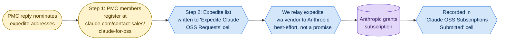

<!-- SPDX-License-Identifier: Apache-2.0
     https://www.apache.org/licenses/LICENSE-2.0 -->

# apache/security

Operational home for the ASF Security team. Holds the reusable
**agent skills** (a.k.a. SKILLs) the team uses to run the
Mythos / Glasswing scan program end-to-end, plus the upstream
[`threat-model-producer`](.github/skills/threat-model-producer/SKILL.md)
recipe used to bootstrap project threat models when a PMC
doesn't have one yet.

If you landed here looking for **how to report a security
vulnerability in an Apache project**, see
<https://www.apache.org/security/> — this repo is the Security
team's tooling, not the public reporting entry point.

## What's in this repository

```
.github/skills/                     — canonical home of all SKILLs
├── README.md                       — per-SKILL index + contribution notes
├── glasswing-scan-run/             — periodic-sweep umbrella
├── glasswing-scan-response/        — handles inbound [GLASSWING] requests
├── glasswing-model-verify/         — pre-flight model assessment
├── glasswing-scan-update/          — all writes to the Mythos tracker
│   └── sheets_writer.py            — OAuth-authenticated Sheets helper
├── glasswing-scan-status/          — status / rollup view
├── glasswing-scan-submit/          — operator-gated dual-email submission flow
│                                      (Email 1 to vendor, Email 2 to PMC)
├── glasswing-scan-forward/         — slop-filter + forward results to PMC
└── threat-model-producer/          — model-authoring rubric (imported from
                                      Scovetta's gist)

.claude/skills/                     — symlinks so Claude Code finds the SKILLs
```

Adding a new agent-runtime convention later means adding another
symlink under that runtime's expected location — never duplicating
content.

## The Mythos / Glasswing scan program

Mythos (internal name) / Glasswing (public name) is an
Alpha-Omega / OpenAI partnership that lets Apache PMCs opt in to
**agentic security scans** of their repositories. The compute
cost is on the program; the PMC commits to (a) triaging real
findings and (b) maintaining a threat model the scan can run
against. The Security team coordinates the operational side:
inbound requests, pre-flight checks, vendor handoff, slop-filter
of returned reports, and delivery to the PMC.

### Pipeline

**Scan pipeline** (one path; operator-gated):

```mermaid
flowchart LR
    PMC([PMC sends<br/>GLASSWING request]):::pmc --> R{{scan-response<br/>gates 1-4}}:::skill
    R --> V{{model-verify<br/>per-repo discoverability +<br/>completeness}}:::skill
    V --> P{{scan-response<br/>pre-flight-pass template<br/>pitch + OSS-tooling offer}}:::skill
    P --> PR([PMC reply<br/>expedite list / 'none' /<br/>scoping]):::pmc
    PR --> G{{Operator gate<br/>explicit per-PMC<br/>go-ahead}}:::gate
    G --> S{{scan-submit<br/>Email 1: vendor request<br/>Email 2: PMC notification}}:::skill
    S --> M[(Mirko @<br/>Alpha-Omega<br/>runs the scan)]:::vendor
    M --> F{{scan-forward<br/>slop-filter against model}}:::skill
    F --> A[(Archive to scans/<br/>md + .json + .notes.md<br/>committed to private repo)]:::archive
    A --> RES([Curated findings<br/>delivered to PMC<br/>citing archive filename]):::pmc
    RES --> T([PMC normal triage<br/>CVE / disclosure / release]):::pmc

    classDef pmc fill:#fff3cd,stroke:#9a7d00,color:#553e00
    classDef skill fill:#d4e6f9,stroke:#1f6feb,color:#0a2e5c
    classDef gate fill:#ffcccc,stroke:#cc0000,color:#660000
    classDef vendor fill:#e2d6f9,stroke:#6f42c1,color:#3d2469
    classDef archive fill:#cfe9d7,stroke:#1f7a3a,color:#0a3a1c
```



**OSS-tooling side flow** (parallel, non-blocking on the
scan pipeline). The PMC's reply to the pitch above may
nominate `@apache.org` addresses for an
Anthropic-Claude-for-Open-Source subscription expedite
ask. If it does, the flow is:



The two flows are independent: the scan can be submitted
with or without an OSS expedite ask in flight, and an
expedite can be relayed before, during, or after the scan
submission. The pitch step in the scan pipeline raises
the OSS-tooling offer (one outbound email), and the PMC
reply step collects both decisions in one inbound
response.

The **archive step** (`scans/`) is the canonical audit trail —
every scan we forward to a PMC lands there as three files:
`<project>-<repo>-<YYYY-MM-DD>-<short-sha>.md` (the curated
findings as forwarded), a `.json` sidecar (Mirko's raw report
verbatim, so the slop-filter pass is auditable), and a
`.notes.md` sidecar (per-finding decision log). The archive
filename is cited in the PMC-facing email so the PMC has a
stable identifier without needing access to this private repo.
See [`scans/README.md`](scans/README.md) for the layout, the
metadata-header spec, and the confidentiality rules.

Every transition between blocks is a write to the **Mythos
tracker spreadsheet** (the team's shared coordination workbook,
not in this repo); SKILLs read and write specific columns to
keep the per-PMC state visible to the whole team.

### Per-PMC state machine

A scan-requested PMC sits in exactly one pipeline state at any
moment. `glasswing-scan-run`'s classifier (and `build-status-tab`'s
color coding) follow this state machine:

```mermaid
stateDiagram-v2
    [*] --> NewRequest: PMC sends<br/>GLASSWING request
    NewRequest --> PreFlight: gates 1-4 pass
    NewRequest --> BlockedGate2: non-apache.org<br/>sender + no @a.o stated
    BlockedGate2 --> PreFlight: identity anchored
    PreFlight --> ModelVerifyPending: scope confirmed
    ModelVerifyPending --> PreFlightPassedPitchNotSent: model passes rubric<br/>+ every repo discoverable
    ModelVerifyPending --> BlockedDiscoverability: some repos lack AGENTS.md
    BlockedDiscoverability --> ModelVerifyPending: PRs merged<br/>or scope narrowed
    PreFlightPassedPitchNotSent --> PreFlightPassedAwaitingPmcPitchReply: pitch sent<br/>(scan-response pre-flight-pass<br/>template; OSS-tooling offer)
    PreFlightPassedAwaitingPmcPitchReply --> PmcPitchRepliedAwaitingOperatorDecision: PMC replies<br/>(expedite list / 'none' /<br/>scoping clarification)
    PmcPitchRepliedAwaitingOperatorDecision --> Submitted: operator says "submit"<br/>(scan-submit dual-email flow:<br/>Email 1 vendor + Email 2 PMC)
    Submitted --> Triaging: vendor returns report
    Triaging --> ArchivedForwarded: slop-filter pass +<br/>commit to scans/ +<br/>forwarding email sent
    ArchivedForwarded --> [*]: PMC triages normally
```

The colors in the Status tab map onto this progression
(light-red Pre-flight → light-red ModelVerifyPending →
yellow PreFlightPassed* (three sub-states) →
light-green Submitted → medium-green Triaging →
dark-green ArchivedForwarded). `ArchivedForwarded` is a
brief, mostly-synchronous step: the archive commit and
the forwarding-email draft are produced together, and the
user's single approval covers both before the email is
sent.

The three `PreFlightPassed*` sub-states reflect the new
operator-gated workflow: pre-flight passing is no longer
an automatic trigger for submission. Instead, the
`scan-response` pre-flight-pass template goes out first
(raising the OSS-tooling offer + asking for scoping
follow-up), the PMC replies, then the Security team
operator decides per-PMC whether to invoke
`scan-submit`'s two-email flow. The OSS subscription
expedite ask travels through a parallel side flow (see
the pipeline diagram above) and does not gate the scan
itself.

### Typical interaction

```mermaid
sequenceDiagram
    autonumber
    participant PMC
    participant Sec as Security Team
    participant V as Vendor (Alpha-Omega)
    participant A as Anthropic
    PMC->>Sec: GLASSWING request<br/>(repos, contacts, model URL)
    Sec->>Sec: scan-response: gates 1-4
    Sec-->>PMC: Scope confirmation reply<br/>(if PMC has more active repos)
    PMC-->>Sec: Confirms scope
    Sec->>Sec: model-verify: per-repo<br/>discoverability + completeness
    alt Discoverability gaps
        Sec-->>PMC: PR adding AGENTS.md /<br/>SECURITY.md
        PMC-->>Sec: Merges PR
        Sec->>Sec: model-verify re-runs
    end
    Sec-->>PMC: Pre-flight-pass template<br/>(scan ready when you say go;<br/>OSS-tooling offer for triagers)
    PMC-->>Sec: Reply (expedite list / 'none' /<br/>scoping clarification)
    opt PMC nominated expedite addresses
        Note over PMC,A: PMC members first register at<br/>https://claude.com/contact-sales/claude-for-oss
        Sec->>Sec: Write addresses to<br/>'Expedite Claude OSS Requests' cell
    end
    Note over Sec: Wait for operator gate<br/>(explicit per-PMC go-ahead)
    Sec->>V: Email 1 — scan-submit<br/>(mirko@alpha-omega.dev,<br/>CC security@apache.org only;<br/>body includes expedite addresses<br/>if PMC nominated any)
    Sec-->>PMC: Email 2 — PMC notification<br/>(scan request submitted;<br/>results forthcoming;<br/>NO vendor identity in body)
    par OSS side flow (only if expedite asked)
        V->>A: Vendor relays expedite ask
        A-->>Sec: Subscription grant confirmation
        Sec->>Sec: Append to<br/>'Claude OSS Subscriptions<br/>Submitted' cell
    and Scan path
        V-->>Sec: Scan report
        Sec->>Sec: scan-forward: slop-filter<br/>against model + §11a
        Sec->>Sec: Archive to scans/<br/>(md + .json + .notes.md commit)
        Sec-->>PMC: Curated findings<br/>+ filtered appendix<br/>(cites archive filename;<br/>NO vendor identity in body)
    end
    PMC->>PMC: Triage / CVE /<br/>coordinated disclosure
```

## How to use the SKILLs

### One-time setup per Security-team member

1. **Clone this repo**, locally or wherever your agent runtime
   reads SKILLs from (Claude Code's `.claude/skills/` symlinks
   point at `.github/skills/`).

2. **Add a memory entry** that points at the Mythos tracker
   spreadsheet (the coordination URL stays out of the repo —
   it lives in user-scope memory). The
   [`glasswing-scan-status`](.github/skills/glasswing-scan-status/SKILL.md)
   SKILL describes the entry shape; the file ID + view URL
   come from the team.

3. **Authorize OAuth for the Sheets helper.** The
   [`glasswing-scan-update`](.github/skills/glasswing-scan-update/SKILL.md)
   SKILL walks through it:
   - Create a Google Cloud OAuth client (Desktop app type),
     enable the Sheets API.
   - Drop `oauth_client_secret.json` in
     `~/.config/asf-security/glasswing/` — **outside the repo**
     by deliberate choice; per-user, no shared service account.
   - Run `sheets_writer.py setup` once to mint a refresh token.
   - Make sure you have Editor access to the workbook.

4. **Authenticate to ponymail** the first time you do a sweep
   that needs direct thread permalinks: run
   `mcp__ponymail__login` (opens a browser for ASF LDAP). The
   session cookie caches; you'll rarely re-run.

### Periodic work loop

Whenever you sit down to do Glasswing work, start with the
umbrella sweep:

```
glasswing-scan-run
```

It does a read-only sweep across Gmail, the tracker
spreadsheet, the GitHub PRs the team has opened on PMC repos,
and Mirko correspondence. It emits a single action list,
classified by pipeline stage, with the per-task SKILL named
for each next action. Pick an item and invoke that SKILL.

The sweep also refreshes the `Status` tab in the workbook, so
anyone reading the spreadsheet sees the same picture you do —
including counts of open / merged PRs per PMC (parsed out of
the `PR/Issues` cell via `gh pr view`).

### When a GLASSWING request arrives

→ Use [`glasswing-scan-response`](.github/skills/glasswing-scan-response/SKILL.md).
It runs gates 1–4 on the request (required fields, sender
identity rooted in `@apache.org`, PMC roster, scope confirmation
against the PMC's active repos), pulls embedded questions out
of the request body, and drafts a reply that addresses each.
Output is a Gmail draft — review and click Send yourself.

### When a PMC confirms scope or replies on a thread

→ Same SKILL. The procedure also writes the confirmed
repo list to the tracker's `Repositories requested` cell via
[`glasswing-scan-update`](.github/skills/glasswing-scan-update/SKILL.md).

### When a model needs pre-flight verification

→ Use [`glasswing-model-verify`](.github/skills/glasswing-model-verify/SKILL.md).
Reads the PMC's confirmed repo list, walks each repo's
discoverability chain (`AGENTS.md` → `SECURITY.md` → model
URL), assesses the model itself against the
[`threat-model-producer`](.github/skills/threat-model-producer/SKILL.md)
minimum-bar rubric. Produces either a PR (for mechanical
fixes — typically adding two pointer files at the repo root)
or an email-reply with the gaps framed as proposals. When a
PMC needs PRs across multiple repos, each PR URL is appended
on a new line in the `PR/Issues` cell — never overwriting.

### When pre-flight passes for a PMC

→ Use [`glasswing-scan-response`](.github/skills/glasswing-scan-response/SKILL.md)'s
**pre-flight-pass template**. Sends one email back to the
PMC thread: confirms pre-flight is complete, raises the
Anthropic-Claude-for-OSS subscription offer for PMC
triagers (with register-first sequencing + the
best-effort-via-vendor framing), and asks the PMC for any
`@apache.org` addresses to nominate for the expedite ask.
The PMC's reply lands as either an expedite list or
"none" in the `Expedite Claude OSS Requests` cell. After
that, the PMC sits in
`pmc-pitch-replied-awaiting-operator-decision` until the
operator says "submit".

This SKILL does **not** auto-trigger `scan-submit`.
Pre-flight passing means we're ready to submit; the
operator decides per-PMC whether to actually queue.

### When the operator says "submit X to Mirko"

→ Use [`glasswing-scan-submit`](.github/skills/glasswing-scan-submit/SKILL.md).
Drafts the **two-email submission flow** for a PMC the
operator has explicitly green-lit:

  - **Email 1** to `mirko@alpha-omega.dev`, CC
    `security@apache.org` only (no PMC people, no
    `private@<pmc>`, no `security@<pmc>`). Body includes
    repos to scan + threat-model URL + (if the PMC
    nominated expedite addresses) a block asking Mirko to
    relay the expedite ask to Anthropic.
  - **Email 2** to the PMC primary, CC backup + named
    contacts + `private@<pmc>` + `security@<pmc>` alias
    (if exists) + `security@apache.org`. Notifies the PMC
    the scan has been queued. **Body redacts vendor
    identity** — "the scan pipeline" / "our vendor
    partner" generic phrasing.

Output is two Gmail drafts; you click Send on each.

### When a scan report comes back from Mirko

→ Use [`glasswing-scan-forward`](.github/skills/glasswing-scan-forward/SKILL.md).
Walks each finding through the
[`threat-model-producer`](.github/skills/threat-model-producer/SKILL.md)
§4.13 disposition rubric (`VALID`, `OUT-OF-MODEL:*`,
`BY-DESIGN:property-disclaimed`, `KNOWN-NON-FINDING`,
`MODEL-GAP`), citing the model section that licenses each
classification. Forwards the keepers to the PMC's listed
scan-result recipients, with the filtered set preserved in an
appendix for audit-trail and spot-checking.

### When the spreadsheet needs an update

→ Use [`glasswing-scan-update`](.github/skills/glasswing-scan-update/SKILL.md)
directly (the other SKILLs hand off to it). The bundled
helper (`sheets_writer.py`) has subcommands for every write
shape: `apply` for row updates, `init-canned-tab` /
`append-canned` for the canned-responses tab,
`insert-column` / `add-columns` / `rename-column` for schema
changes, `build-status-tab` to refresh the auto-generated
Status view.

## Operational rules encoded in the SKILLs

- **CC discipline.** `security@apache.org` on every
  Glasswing reply. PMC-facing replies (from
  `scan-response`, `scan-forward`, and `scan-submit`'s
  Email 2) also CC the PMC's `private@<pmc>.apache.org`
  and `security@<pmc>.apache.org` alias (when one exists,
  looked up via <https://security.apache.org/projects/>).
  **Exception:** `scan-submit`'s **Email 1** — the
  vendor-facing scan request — CC's `security@apache.org`
  **only**, with no PMC recipients of any kind. The
  vendor and PMC threads are kept separate.
- **PMC-facing vendor opacity.** Emails that go to PMC
  audiences (any of the four PMC-facing SKILLs above)
  never name the scan vendor. Canonical wordings: "our
  scan vendor partner" / "our vendor relationship" /
  "the scan pipeline". The Glasswing **program name** is
  fine (it's already in the `[GLASSWING]` subject line).
  Anthropic + Apache Magpie + Claude OSS are fine to
  name; vendor identity (Mirko / Alpha-Omega /
  `mirko@alpha-omega.dev` / "the Glasswing pipeline"
  used as vendor synonym) is what's redacted in
  PMC-facing email bodies. Internal SKILL docs and this
  README name the vendor freely; the redaction is
  PMC-facing-content-only.
- **Identity anchoring.** General discussion can come from
  any email; the formal `[GLASSWING]` request needs at least
  one `@apache.org` address attached, because scan results
  are delivered only to `@apache.org` personal addresses.
- **Scope confirmation.** Always cross-check the PMC's
  requested repos against their active set (non-blank OSSF
  criticality score on the Repositories sheet of the tracker)
  and ask before silently accepting a narrower scope than
  what the PMC actively maintains.
- **Glasswing-name discipline in public artefacts.** PR
  titles, PR bodies, and commit messages on PMC repos use
  neutral phrasing ("an automated agentic security scan we're
  piloting"). The program name stays inside private channels
  (email to `private@<pmc>`, `security@apache.org`, and this
  repo itself).
- **PRs not issues for PMC-side communication.** Many Apache
  projects have GitHub issues disabled, and issues are public
  in any case. PMC-facing follow-ups go on the existing
  `[GLASSWING]` email thread instead.
- **Slop-filter before forwarding.** The PMC receives curated
  findings with disposition labels + section citations, plus
  a filtered-findings appendix. The Security team owes the
  PMC pre-reviewed output, not raw scanner noise.
- **`PR/Issues` is a running list, not a single-slot field.**
  Each PR URL is on its own line; new ones append.
  `build-status-tab` parses every URL out of the cell to
  compute per-PMC `PRs opened (not yet merged)` / `PRs merged` /
  `PRs total` counts, plus a program-wide rollup at the top of
  the Status sheet.

## Memory and secrets boundary

| Where | What lives there | Why |
|---|---|---|
| `apache/security` (this repo, **private**) | SKILL definitions, helper code, seed canned-responses, threat-model-producer rubric, internal README. | Read access limited to Security team members. Anything that needs to be linked externally (currently: the `threat-model-producer` rubric, since PMC-facing emails cite it) is mirrored to a public gist — see the table below. |
| Public mirror of `threat-model-producer` | <https://gist.github.com/potiuk/da14a826283038ddfe38cc9fe6310573> | The rubric is referenced by every outbound PMC-facing email. Maintained by Jarek; sync procedure documented in `§10` of [`threat-model-producer/SKILL.md`](.github/skills/threat-model-producer/SKILL.md). |
| User-scope Claude memory (`~/.claude/.../memory/`) | The Mythos spreadsheet's file ID + view URL (entry name `mythos-tracker`). | The coordination URL is internal to the program; not for the public repo. |
| `~/.config/asf-security/glasswing/` (outside any repo) | OAuth `client_secret.json`, refresh `token.json`. | Per-Security-team-member; no shared service account; every write attributable to a named human. |
| The Mythos spreadsheet | Per-PMC state — opt-in flag, contacts, repos, dates, ponymail thread URLs, model assessment, PR/Issues. | The shared coordination view; SKILLs read and write it via the OAuth helper. |

## Contributing

Improvements to the SKILLs land via PRs to this repo. New SKILLs
go under `.github/skills/<short-name>/SKILL.md` with the YAML
frontmatter (`name`, `description`) the SKILL loaders expect.
See [`.github/skills/README.md`](.github/skills/README.md) for
the per-SKILL conventions and the PR description shape.

## License

Apache License, Version 2.0 —
<https://www.apache.org/licenses/LICENSE-2.0>.
