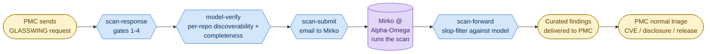
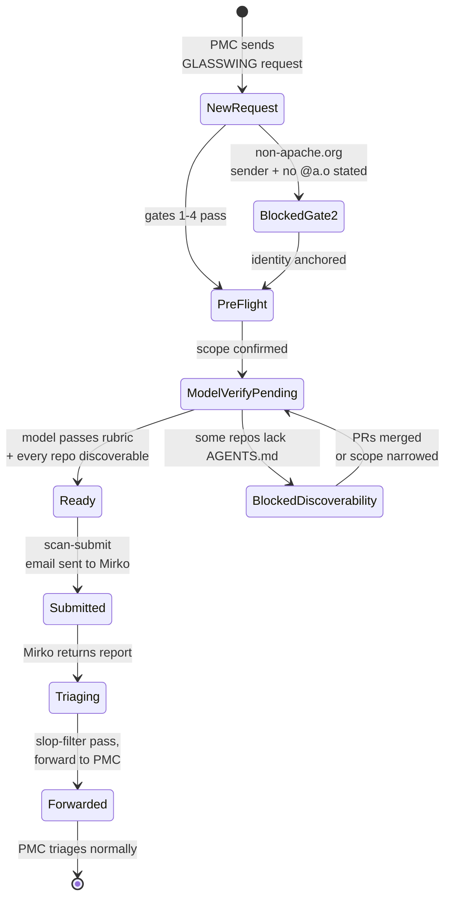
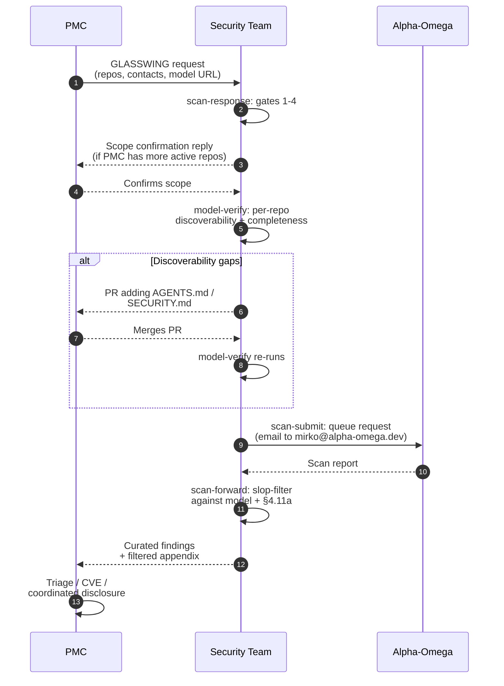

<!-- SPDX-License-Identifier: Apache-2.0
     https://www.apache.org/licenses/LICENSE-2.0 -->

# apache/security

Operational home for the ASF Security team. Holds the reusable
**agent skills** (a.k.a. SKILLs) the team uses to run the
Mythos / Glasswing scan program end-to-end, plus the upstream
[`threat-model-producer`](.github/skills/threat-model-producer/SKILL.md)
recipe used to bootstrap project threat models when a PMC
doesn't have one yet.

If you landed here looking for **how to report a security
vulnerability in an Apache project**, see
<https://www.apache.org/security/> — this repo is the Security
team's tooling, not the public reporting entry point.

## What's in this repository

```
.github/skills/                     — canonical home of all SKILLs
├── README.md                       — per-SKILL index + contribution notes
├── glasswing-scan-run/             — periodic-sweep umbrella
├── glasswing-scan-response/        — handles inbound [GLASSWING] requests
├── glasswing-model-verify/         — pre-flight model assessment
├── glasswing-scan-update/          — all writes to the Mythos tracker
│   └── sheets_writer.py            — OAuth-authenticated Sheets helper
├── glasswing-scan-status/          — status / rollup view
├── glasswing-scan-submit/          — submission email to Alpha-Omega
├── glasswing-scan-forward/         — slop-filter + forward results to PMC
└── threat-model-producer/          — model-authoring rubric (imported from
                                      Scovetta's gist)

.claude/skills/                     — symlinks so Claude Code finds the SKILLs
```

Adding a new agent-runtime convention later means adding another
symlink under that runtime's expected location — never duplicating
content.

## The Mythos / Glasswing scan program

Mythos (internal name) / Glasswing (public name) is an
Alpha-Omega / OpenAI partnership that lets Apache PMCs opt in to
**agentic security scans** of their repositories. The compute
cost is on the program; the PMC commits to (a) triaging real
findings and (b) maintaining a threat model the scan can run
against. The Security team coordinates the operational side:
inbound requests, pre-flight checks, vendor handoff, slop-filter
of returned reports, and delivery to the PMC.

### Pipeline



Every transition between blocks is a write to the **Mythos
tracker spreadsheet** (the team's shared coordination workbook,
not in this repo); SKILLs read and write specific columns to
keep the per-PMC state visible to the whole team.

### Per-PMC state machine

A scan-requested PMC sits in exactly one pipeline state at any
moment. `glasswing-scan-run`'s classifier (and `build-status-tab`'s
color coding) follow this state machine:



The colors in the Status tab map onto this progression
(light-red Pre-flight → yellow Ready → light-green Submitted →
medium-green Triaging → dark-green Forwarded).

### Typical interaction



## How to use the SKILLs

### One-time setup per Security-team member

1. **Clone this repo**, locally or wherever your agent runtime
   reads SKILLs from (Claude Code's `.claude/skills/` symlinks
   point at `.github/skills/`).

2. **Add a memory entry** that points at the Mythos tracker
   spreadsheet (the coordination URL stays out of the repo —
   it lives in user-scope memory). The
   [`glasswing-scan-status`](.github/skills/glasswing-scan-status/SKILL.md)
   SKILL describes the entry shape; the file ID + view URL
   come from the team.

3. **Authorize OAuth for the Sheets helper.** The
   [`glasswing-scan-update`](.github/skills/glasswing-scan-update/SKILL.md)
   SKILL walks through it:
   - Create a Google Cloud OAuth client (Desktop app type),
     enable the Sheets API.
   - Drop `oauth_client_secret.json` in
     `~/.config/asf-security/glasswing/` — **outside the repo**
     by deliberate choice; per-user, no shared service account.
   - Run `sheets_writer.py setup` once to mint a refresh token.
   - Make sure you have Editor access to the workbook.

4. **Authenticate to ponymail** the first time you do a sweep
   that needs direct thread permalinks: run
   `mcp__ponymail__login` (opens a browser for ASF LDAP). The
   session cookie caches; you'll rarely re-run.

### Periodic work loop

Whenever you sit down to do Glasswing work, start with the
umbrella sweep:

```
glasswing-scan-run
```

It does a read-only sweep across Gmail, the tracker
spreadsheet, the GitHub PRs the team has opened on PMC repos,
and Mirko correspondence. It emits a single action list,
classified by pipeline stage, with the per-task SKILL named
for each next action. Pick an item and invoke that SKILL.

The sweep also refreshes the `Status` tab in the workbook, so
anyone reading the spreadsheet sees the same picture you do —
including counts of open / merged PRs per PMC (parsed out of
the `PR/Issues` cell via `gh pr view`).

### When a GLASSWING request arrives

→ Use [`glasswing-scan-response`](.github/skills/glasswing-scan-response/SKILL.md).
It runs gates 1–4 on the request (required fields, sender
identity rooted in `@apache.org`, PMC roster, scope confirmation
against the PMC's active repos), pulls embedded questions out
of the request body, and drafts a reply that addresses each.
Output is a Gmail draft — review and click Send yourself.

### When a PMC confirms scope or replies on a thread

→ Same SKILL. The procedure also writes the confirmed
repo list to the tracker's `Repositories requested` cell via
[`glasswing-scan-update`](.github/skills/glasswing-scan-update/SKILL.md).

### When a model needs pre-flight verification

→ Use [`glasswing-model-verify`](.github/skills/glasswing-model-verify/SKILL.md).
Reads the PMC's confirmed repo list, walks each repo's
discoverability chain (`AGENTS.md` → `SECURITY.md` → model
URL), assesses the model itself against the
[`threat-model-producer`](.github/skills/threat-model-producer/SKILL.md)
minimum-bar rubric. Produces either a PR (for mechanical
fixes — typically adding two pointer files at the repo root)
or an email-reply with the gaps framed as proposals. When a
PMC needs PRs across multiple repos, each PR URL is appended
on a new line in the `PR/Issues` cell — never overwriting.

### When a model is verified and ready to queue

→ Use [`glasswing-scan-submit`](.github/skills/glasswing-scan-submit/SKILL.md).
Drafts the scan-submission email to Mirko, with the PMC name
in the subject and CC discipline (`security@apache.org`,
`private@<pmc>.apache.org`, named contacts). Output is a
Gmail draft; you click Send.

### When a scan report comes back from Mirko

→ Use [`glasswing-scan-forward`](.github/skills/glasswing-scan-forward/SKILL.md).
Walks each finding through the
[`threat-model-producer`](.github/skills/threat-model-producer/SKILL.md)
§4.13 disposition rubric (`VALID`, `OUT-OF-MODEL:*`,
`BY-DESIGN:property-disclaimed`, `KNOWN-NON-FINDING`,
`MODEL-GAP`), citing the model section that licenses each
classification. Forwards the keepers to the PMC's listed
scan-result recipients, with the filtered set preserved in an
appendix for audit-trail and spot-checking.

### When the spreadsheet needs an update

→ Use [`glasswing-scan-update`](.github/skills/glasswing-scan-update/SKILL.md)
directly (the other SKILLs hand off to it). The bundled
helper (`sheets_writer.py`) has subcommands for every write
shape: `apply` for row updates, `init-canned-tab` /
`append-canned` for the canned-responses tab,
`insert-column` / `add-columns` / `rename-column` for schema
changes, `build-status-tab` to refresh the auto-generated
Status view.

## Operational rules encoded in the SKILLs

- **CC discipline.** `security@apache.org` on every Glasswing
  reply; the PMC's `private@<pmc>.apache.org` and
  `security@<pmc>.apache.org` alias (when one exists, looked
  up via <https://security.apache.org/projects/>).
- **Identity anchoring.** General discussion can come from
  any email; the formal `[GLASSWING]` request needs at least
  one `@apache.org` address attached, because scan results
  are delivered only to `@apache.org` personal addresses.
- **Scope confirmation.** Always cross-check the PMC's
  requested repos against their active set (non-blank OSSF
  criticality score on the Repositories sheet of the tracker)
  and ask before silently accepting a narrower scope than
  what the PMC actively maintains.
- **Glasswing-name discipline in public artefacts.** PR
  titles, PR bodies, and commit messages on PMC repos use
  neutral phrasing ("an automated agentic security scan we're
  piloting"). The program name stays inside private channels
  (email to `private@<pmc>`, `security@apache.org`, and this
  repo itself).
- **PRs not issues for PMC-side communication.** Many Apache
  projects have GitHub issues disabled, and issues are public
  in any case. PMC-facing follow-ups go on the existing
  `[GLASSWING]` email thread instead.
- **Slop-filter before forwarding.** The PMC receives curated
  findings with disposition labels + section citations, plus
  a filtered-findings appendix. The Security team owes the
  PMC pre-reviewed output, not raw scanner noise.
- **`PR/Issues` is a running list, not a single-slot field.**
  Each PR URL is on its own line; new ones append.
  `build-status-tab` parses every URL out of the cell to
  compute open/merged counts.

## Memory and secrets boundary

| Where | What lives there | Why |
|---|---|---|
| `apache/security` (this repo) | SKILL definitions, helper code, seed canned-responses, threat-model-producer rubric, public README. | Public; team-internal patterns that are safe to share externally. |
| User-scope Claude memory (`~/.claude/.../memory/`) | The Mythos spreadsheet's file ID + view URL (entry name `mythos-tracker`). | The coordination URL is internal to the program; not for the public repo. |
| `~/.config/asf-security/glasswing/` (outside any repo) | OAuth `client_secret.json`, refresh `token.json`. | Per-Security-team-member; no shared service account; every write attributable to a named human. |
| The Mythos spreadsheet | Per-PMC state — opt-in flag, contacts, repos, dates, ponymail thread URLs, model assessment, PR/Issues. | The shared coordination view; SKILLs read and write it via the OAuth helper. |

## Contributing

Improvements to the SKILLs land via PRs to this repo. New SKILLs
go under `.github/skills/<short-name>/SKILL.md` with the YAML
frontmatter (`name`, `description`) the SKILL loaders expect.
See [`.github/skills/README.md`](.github/skills/README.md) for
the per-SKILL conventions and the PR description shape.

## License

Apache License, Version 2.0 —
<https://www.apache.org/licenses/LICENSE-2.0>.
